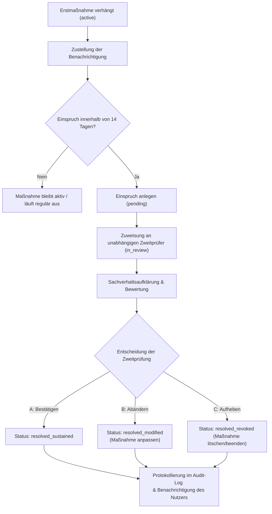

# BACKOFFICE_EINSPRUCHS_FLOW.md — Einspruchsstelle und Backoffice-Fluss für LOCUTERRA V0.1

Stand: 2026-06-15

> Dieses Dokument formalisiert die Governance-, Moderations- und Einspruchslogik von LOCUTERRA V0.1
> in einen konkreten, nachvollziehbaren Bearbeitungsfluss für das Weboberflächen-Backoffice.
> Grundlage: GOVERNANCE.md, DATENMODELL.md, workflows/konfliktfaelle_meldung_triage_einspruch.md.

---

## 1. Ziel und Geltungsbereich

Um Machtmissbrauch zu verhindern und das Vertrauen in ein gemeinwohlorientiertes soziales Netzwerk zu sichern, darf die Moderation von LOCUTERRA keine Einbahnstraße sein. Der Einspruchs-Flow stellt sicher, dass betroffene Bürger Maßnahmen der Erstmoderation unabhängig prüfen lassen können.

Dieser Fluss gilt für alle im MVP 0.1 vorgesehenen Moderationsentscheidungen:
- Ausblenden von Beiträgen, Ressourcen, Kanälen oder Gruppen (`hide`)
- Reichweitenbeschränkung von Inhalten (`restrict_reach`)
- Temporäre Sperrung von Kontaktwegen (`restrict_contact`)
- Temporäre Einschränkung oder Sperrung von Bürgerkonten (`suspend`)

---

## 2. Akteure und Rollentrennung

Im MVP 0.1 sind die beteiligten Rollen strikt getrennt:

| Rolle | Akteur | Verantwortlichkeiten im Einspruchs-Flow |
|---|---|---|
| **Betroffener Bürger** | Registrierter Nutzer | Erhält Benachrichtigung, reicht Einspruch mit Begründung ein. |
| **Erstmoderator** | Plattform-Moderation | Führt Triage durch, verhängt Erstmaßnahme, protokolliert Begründung. Ist von der Zweitprüfung ausgeschlossen. |
| **Zweitprüfer (Einspruchsstelle)** | Unabhängige Prüfstelle | Sichtet den Einspruch, fordert ggf. Details an, entscheidet unabhängig. |
| **System-Audit-Log** | Technische Komponente | Protokolliert jeden Bearbeitungs- und Statusübergang unveränderlich. |

---

## 3. Erweiterung des logischen Datenmodells

Zur Abbildung des Einspruchs-Flows wird das logische Datenmodell aus `DATENMODELL.md` um zwei Entitäten erweitert:

### Entität `moderation_action` (Moderationsmaßnahme)
Repräsentiert den Eingriff der Erstmoderation.

```typescript
interface ModerationAction {
  id: string;                    // UUID
  targetKind: 'account' | 'resource' | 'group' | 'channel' | 'message';
  targetId: string;              // ID des betroffenen Objekts
  actionType: 'hide' | 'restrict_reach' | 'restrict_contact' | 'suspend';
  status: 'active' | 'expired' | 'revoked_by_appeal' | 'modified_by_appeal';
  reason: string;                // Interne Begründung des Erstmoderators
  publicReason: string;          // Für den Nutzer sichtbare Begründung
  createdByAccountId: string;    // ID des Erstmoderators
  createdAt: Date;
  expiresAt: Date | null;        // Null bei dauerhaften Maßnahmen
}
```

### Entität `appeal` (Einspruch)
Repräsentiert den durch einen Bürger initiierten Überprüfungsprozess.

```typescript
interface Appeal {
  id: string;                    // UUID
  moderationActionId: string;    // Referenz auf die Moderationsmaßnahme
  accountId: string;             // Initiator des Einspruchs (Betroffener)
  status: 'pending' | 'in_review' | 'resolved_sustained' | 'resolved_modified' | 'resolved_revoked' | 'rejected_invalid';
  userJustification: string;     // Begründungstext des Bürgers
  attachmentRefs: string[];      // Belege (z. B. Screenshots, Dokumente)
  reviewerAccountId: string | null; // Zugewiesener Zweitprüfer (Einspruchsstelle)
  resolutionReason: string | null;  // Interne Begründung der Zweitprüfung
  resolutionPublicReason: string | null; // Für den Nutzer sichtbare Begründung
  createdAt: Date;
  resolvedAt: Date | null;
}
```

---

## 4. Schritt-für-Schritt-Workflow



### Schritt 1: Zustellung der Erstmaßnahme (Fristbeginn)
Sobald eine `moderation_action` auf `active` gesetzt wird, generiert das System eine Benachrichtigung an den betroffenen Bürger. Diese enthält:
- Die konkrete Maßnahme und das betroffene Objekt.
- Die öffentliche Begründung (`publicReason`).
- Das Aktenzeichen (`moderationActionId`).
- Einen Link zum Einspruchsformular mit einer **Frist von 14 Tagen** ab Zustellung.

### Schritt 2: Einreichung des Einspruchs
Der Bürger füllt das Einspruchsformular aus. Gefordert sind:
- Begründung, warum die Maßnahme unverhältnismäßig oder fehlerhaft ist.
- Ggf. Dateianhänge zur Entlastung.
Das Absenden erzeugt ein `appeal` im Status `pending` und sperrt eine erneute Einreichung für dieselbe Maßnahme.

### Schritt 3: Eingang & Triage (Prüfung auf Zulässigkeit)
Das Backoffice-System prüft den Einspruch automatisch:
- Liegt die Einreichung innerhalb der 14-Tage-Frist? (Falls nein: Status `rejected_invalid` mit Systemnotiz „Fristüberschreitung").
- Ist die referenzierte `moderation_action` noch aktiv? (Falls bereits abgelaufen und kein fortbestehendes Interesse belegt: Status `rejected_invalid`).

### Schritt 4: Unabhängige Zuweisung (Vier-Augen-Prinzip)
Der Einspruch wird einem Zweitprüfer zugewiesen.
> [!IMPORTANT]
> **Ausschlussregel:** Das System verhindert hardcodiert, dass `reviewerAccountId` identisch mit dem `createdByAccountId` der zugrundeliegenden `moderation_action` ist. Erstprüfer dürfen niemals ihre eigenen Fälle überprüfen.

Der Status wechselt auf `in_review`.

### Schritt 5: Sachverhaltsaufklärung und Bewertung
Der Zweitprüfer sieht im Backoffice eine konsolidierte Fallakte:
1. **Das betroffene Objekt:** Inhalt des Beitrags, Details der Gruppe oder des Kanals.
2. **Die Historie:** Wer hat wann gemeldet? Welche Verstöße gab es in der Vergangenheit?
3. **Die Erstentscheidung:** Interner Begründungstext des Erstmoderators.
4. **Die Gegendarstellung:** Begründung und Belege des Bürgers.

### Schritt 6: Entscheidung und Ausführung
Der Zweitprüfer wählt eine von drei Lösungsoptionen:

*   **A: Bestätigen (resolved_sustained):** Die Erstmaßnahme war korrekt und verhältnismäßig. Sie bleibt unverändert bestehen.
*   **B: Abändern (resolved_modified):** Die Maßnahme war im Kern berechtigt, aber zu streng. Die `moderation_action` wird modifiziert (z. B. Verkürzung der Kontosperre von 7 Tagen auf 2 Tage; Umwandlung einer Kanalsperre in eine Drosselung).
*   **C: Aufheben (resolved_revoked):** Die Maßnahme war fehlerhaft oder unverhältnismäßig. Das System macht den Eingriff rückgängig (z. B. Beitrag wieder sichtbar machen, Sperre aufheben).

### Schritt 7: Zustellung und Audit-Log
- Das System aktualisiert die Statuswerte der beteiligten `appeal`- und `moderation_action`-Datensätze.
- Ein neues `audit_event` mit der Aktion `appeal_resolve` und dem Risikolevel `medium` wird geschrieben.
- Der Bürger wird über das Ergebnis und die Begründung (`resolutionPublicReason`) benachrichtigt.

---

## 5. Web-Backoffice-Schnittstellendesign (Screendesign)

Für das Web-Backoffice des MVP v0.1 werden drei Ansichten definiert.

### Ansicht 1: Dashboard der Einspruchsstelle
Übersicht über alle eingehenden Einsprüche zur Zuweisung und Bearbeitung.

- **Tabellenansicht** mit den Spalten:
  - `ID` (Einspruchs-ID)
  - `Eingangsdatum` (Farblich markiert: Rot, wenn Frist zur Bearbeitung abzulaufen droht)
  - `Typ der Maßnahme` (z. B. Kontosperre, Inhaltsausblendung)
  - `Betroffener Nutzer`
  - `Erstmoderator`
  - `Status` (`pending`, `in_review`)
  - `Aktion` (Button: „Fallakte öffnen")

### Ansicht 2: Konsolidierte Fallakte (Detailansicht)
Gegenüberstellung von Erstentscheidung und Einspruch für eine objektive Prüfung.

```
+--------------------------------------------------------------------------------------+
| FALLAKTE: Einspruch #APP-88392-12                                   Status: IN_REVIEW|
+--------------------------------------------------------------------------------------+
| BETROFFENER NUTZER: @garten_klaus (ID: acc-9281)                                      |
+--------------------------------------------------------------------------------------+
| Erstentscheidung (#MOD-4428)         | Einspruch des Nutzers                         |
| Erstmoderator: @steward_marie        | Eingereicht am: 2026-06-14 18:22              |
| Datum: 2026-06-12 10:15              |                                               |
|                                      |                                               |
| Maßnahme: Kontosperre (7 Tage)       | Begründung:                                   |
|                                      | "Ich habe keine Werbung gepostet. Der Link    |
| Interner Grund:                      | führte zum offiziellen, kostenlosen Flyer     |
| "Nutzer spammt gewerblichen Link in  | des Nachbarschaftsfests Grüntal-Süd. Das ist  |
| Nachbarschafts-Kanal Grüntal."       | gemeinnützig und keine kommerzielle Werbung!"|
|                                      |                                               |
| Gemeldeter Inhalt:                   | Belege:                                       |
| "Kommt alle zum Fest! Mehr Infos:    | [ ] gartenfest_flyer_2026.pdf (1.2 MB)        |
| www.gruental-gartenverein.de/fest"   |                                               |
+--------------------------------------------------------------------------------------+
| Audit-Historie:                                                                      |
| - 2026-06-12 10:02: Inhalt gemeldet als 'Spam' durch @nutzer_peter                   |
| - 2026-06-12 10:15: Triage 'Spam', Maßnahme 'suspend' (7 Tage) durch @steward_marie  |
+--------------------------------------------------------------------------------------+
```

### Ansicht 3: Entscheidungsmaske
Eingabeformular am Ende der Detailansicht für den Zweitprüfer.

- **Radio-Buttons für Resolution:**
  - `[ ] Erstentscheidung bestätigen`
  - `[ ] Maßnahme abändern` (Öffnet Zusatzfelder: Neuer Ablaufzeitpunkt, neuer Maßnahmentyp)
  - `[ ] Maßnahme aufheben & Inhalt wiederherstellen`
- **Textfeld „Begründung für den Nutzer (wird zugestellt)“** (Pflichtfeld)
- **Textfeld „Interne Begründung (für Audit-Log)“** (Pflichtfeld)
- **Button: „Prüfung abschließen und ausführen“** (Löst Systemänderung und E-Mail/Systemnachricht aus)

---

## 6. MVP-Regeln und Fristen

1. **Einspruchsfrist:** Strikte 14 Tage ab digitaler Zustellbarkeit der Erstmaßnahme.
2. **Bearbeitungsfrist:** Die Einspruchsstelle soll Einsprüche gegen *Kontosperren* innerhalb von **72 Stunden** bearbeiten. Einsprüche gegen *Inhaltsausblendungen* innerhalb von **7 Tagen**.
3. **Automatisches Auslaufen:** Befristete Erstmaßnahmen (z. B. 24h-Kanalsperre) laufen systemseitig automatisch ab, auch wenn ein Einspruch noch in Prüfung ist. Der Einspruch dient dann der Feststellung der Rechtswidrigkeit für das Nutzerkonto (Löschung des Eintrags im Sündenregister des Nutzers zur Vermeidung von „Cumulative Penalties").
4. **Keine aufschiebende Wirkung:** Ein Einspruch setzt die verhängte Erstmaßnahme nicht vorläufig aus (Prinzip „Erst schützen, dann klären").

---

## 7. Verankerung im Demonstrator

Im Next.js-Demonstrator wird die Einspruchslogik wie folgt simuliert:
- Mock-Daten für ausstehende und entschiedene Einsprüche in `demo/src/data/appeals.ts`.
- Eine Administrations- bzw. Moderationstestfläche simuliert das Backoffice.
- Ein Unit-Test in `demo/tests/pwa.test.mjs` verifiziert das Datenmodell und die Einhaltung der Unabhängigkeitsregeln.
